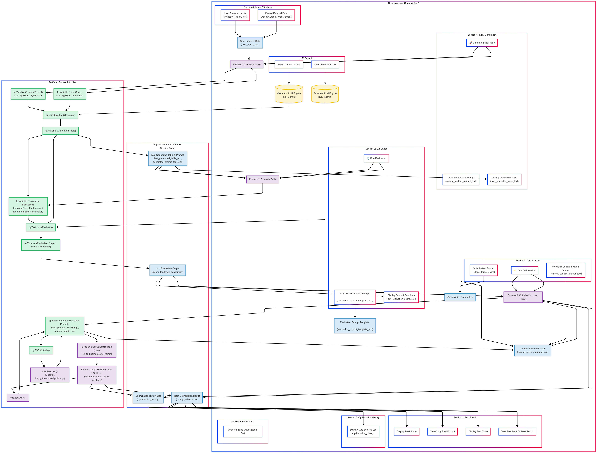

# AutoPrompt: The Self-Correcting AI Analyst

**AutoPrompt is an enterprise-grade prototype that automates the generation and optimization of complex analytical reports. It transforms a generic Large Language Model (LLM) into a specialized, high-performing analyst for any given task, without the need for costly fine-tuning.**

This tool addresses one of the most expensive bottlenecks in modern business: the manual translation of raw, unstructured data into actionable, structured intelligence. It demonstrates a paradigm shift from simply *using* AI to creating **self-correcting AI systems.**



---

## The Business Problem: The High Cost of Manual Analysis

Imagine a team of highly paid market analysts. Their mission is to produce a quarterly competitive intelligence report. Today, their workflow looks like this:

1.  **Data Overload:** They spend days sifting through hundreds of news articles, internal memos, and web data.
2.  **Manual Synthesis:** They painstakingly identify key events, trends, and disruptions relevant to their specific industry and region.
3.  **Inconsistent Structuring:** They manually populate a complex spreadsheet, trying to fit their findings into predefined columns like "Strategic Imperative," "Impact Score," and "Source."
4.  **Subjective Scoring:** The "Impact Score" and "Side details" are based on individual judgment, leading to inconsistencies between analysts and across reports.

This process is the definition of a **high-cost, low-scalability bottleneck.** It's slow, expensive, and the quality of the final product is heavily dependent on the individual analyst's skill and diligence.

## Our Solution: Automate Expertise, Not Just Tasks

AutoPrompt solves this problem by creating a **digital "Manager-Analyst" duo** that can perform this task automatically, consistently, and at scale.

- The **"Analyst LLM"** (Generator) takes the raw data and makes the first attempt at creating the report.
- The **"Manager LLM"** (Evaluator) acts as a quality control expert. Armed with a strict, customizable grading rubric, it reviews the analyst's work, assigns a score, and provides **clear, written instructions on what to fix.**

This automated feedback loop runs iteratively. With each cycle, the Analyst LLM learns from the Manager's feedback and gets smarter, producing a progressively better and more accurate report.

### The Value Proposition: Why This Is a Game-Changer

| Benefit                    | Before AutoPrompt (The Old Way)                                                                    | After AutoPrompt (The New Way)                                                                                                    |
| -------------------------- | -------------------------------------------------------------------------------------------------- | --------------------------------------------------------------------------------------------------------------------------------- |
| **Speed & Cost**           | Days or weeks of expensive analyst time per report.                                                | **Minutes of compute time.** Radically lowers operational costs and frees up human experts for higher-level strategy.               |
| **Agility & Adaptability** | Changing the report format (e.g., adding a new column) requires retraining the entire team.         | **Adapts in minutes, not months.** Simply update the Manager's text-based instructions, and the system learns the new format instantly. |
| **Consistency & Quality**  | Output quality varies by analyst and is prone to human error and bias.                             | **Uniform, high-quality output every time.** The system adheres strictly to the defined quality standards, ensuring consistency.         |
| **Scalability**            | Scaling requires hiring and training more analysts, a linear and expensive process.                | **Infinitely scalable.** Go from producing one report to one hundred reports by simply running the application more times.            |
| **Asset Creation**         | Analyst knowledge is siloed and leaves when the employee does.                                     | **The prompt becomes a managed, version-controlled corporate asset.** We are building a library of reusable, expert "AI Personas." |

---

### A Proven Example: From Generic to Genius in 3 Steps

Let's see AutoPrompt in action. We start with a generic, decent-but-flawed system prompt and ask it to generate a report on "Ride Hailing" in the "Middle East".

#### Step 0: The Initial Prompt & Its Flawed Output

Our starting `System Prompt` is simple. A key instruction for the `Side details` column is:

> *"Guideline 9: For 'Side details', provide a factual explanation. Start with a bolded header. The description MUST be derived from the source."*

**The Problem:** This instruction is too vague. When the **Analyst LLM** (Generator) runs, it produces an output that is technically correct but lacks depth and follows the letter, not the spirit, of the law.

**Generated Table (Initial Output - Score: 68/100):**

| Event or Development                               | ... | Side details                                                                                                                                                                        | Source            |
| -------------------------------------------------- | --- | ----------------------------------------------------------------------------------------------------------------------------------------------------------------------------------- | ----------------- |
| Uber partners with Careem for regional integration | ... | **Partnership Details** -- Uber has partnered with Careem. This partnership is for regional integration and will affect the market. It is based on the information from the sources. | google_agent_output |
| Launch of electric scooter services in Dubai       | ... | **New Service** -- Electric scooter services have been launched in Dubai. This is a new development in the shared mobility sector that companies should be aware of.                   | gnews_output      |

**The Manager LLM's (Evaluator's) Feedback (The Textual Gradient):**
The Evaluator scores this a **68/100** and provides critical feedback:
> *"...Points deducted from A4 ('Side details' Quality). The 'Side details' are too short, conversational, and lack verifiable substance. For example, 'affect the market' is generic. The phrase 'Based on the information' is conversational filler. The prompt needs to enforce a higher standard of detail and remove conversational language..."*

#### The Optimization Loop Begins

AutoPrompt feeds this critique back into the `TGD` optimizer. The optimizer rewrites the `System Prompt`.

#### Step 1: Improved Prompt

The optimizer refines Guideline 9 in the `System Prompt`:

> *"Guideline 9: ...MINIMUM 30 words. CRITICALLY: DO NOT use conversational filler like "Drawing from X...", "Based on Y...". State facts directly."*

The system re-runs the generation. The output is better—it's longer and less conversational. The score improves to **79/100**, but the details are still not specific enough.

#### Step 2: The Final, Optimized Prompt

After another cycle, the optimizer makes a final, crucial refinement, adding a new level of specificity:

> *"Guideline 9: ...MINIMUM 30 words... State facts directly... The description MUST VERIFIABLY synthesize key quantitative data (e.g., market size, investment amounts, user numbers, dates) or qualitative strategic insights (e.g., competitive advantage, target demographic, primary goal) found in the source text."*

#### The Final Result: High-Quality, Actionable Intelligence

This new, highly specific prompt forces the Analyst LLM to perform at a much higher level.

**Generated Table (Final Optimized Output - Score: 94/100):**

| Event or Development                               | ... | Side details                                                                                                                                                                                                                                                                                              | Source                               |
| -------------------------------------------------- | --- | --------------------------------------------------------------------------------------------------------------------------------------------------------------------------------------------------------------------------------------------------------------------------------------------------------- | ------------------------------------ |
| Uber's acquisition of Careem for $3.1 billion      | ... | **Strategic Acquisition Impact** -- Uber's $3.1 billion acquisition of Careem, completed in January 2020, solidifies its dominance in the Middle Eastern ride-hailing market. The deal combines Uber's global expertise with Careem's strong local infrastructure and brand loyalty across 100+ cities. | https://www.example.news/uber-careem |
| Dubai's RTA tenders for 1,500 shared e-scooters    | ... | **Regulatory Expansion** -- Dubai's Roads and Transport Authority (RTA) has tendered a contract for 1,500 e-scooters as part of its goal to expand micro-mobility options. This follows a successful trial phase and signals a permanent, regulated market for operators like Tier and Lime. | gnews_output                         |

This final output is not just "correct"—it is **actionable business intelligence.** It is specific, data-rich, and directly useful to a strategist.

This example proves that by **optimizing the instructions (the prompt)**, we dramatically elevate the quality and value of the AI's output, transforming it from a simple text generator into a reliable junior analyst. AutoPrompt automates this entire improvement process.

---
## The Technical Innovation: How It Works

*(For the AI Engineers and Data Scientists)*

This project's innovation lies in its practical application of **Textual Gradient Descent (TGD)**, a concept from the `textgrad` library. It moves beyond both naive prompting and brittle fine-tuning.

#### The Flaws in Standard Approaches:

*   **Manual Prompting:** Is an art form based on trial-and-error. It's not reproducible, scalable, or rigorous.
*   **Fine-Tuning:** Is brittle and expensive. It requires thousands of labeled examples and creates a static model. If the task requirements change even slightly (e.g., a new column in the report), the entire dataset is invalidated, and the costly fine-tuning process must be repeated.

#### The AutoPrompt Paradigm: Zero-Shot Task Adaptation via Textual Backpropagation

AutoPrompt treats the **System Prompt as a learnable parameter** that can be optimized.

1.  **Forward Pass:** The learnable `System Prompt` (`tg.Variable`) and `User Data` are fed into the **Generator LLM** (`tg.BlackboxLLM`) to produce the `Table Report`. This is our prediction.

2.  **Loss Calculation:** This is the most critical step. The `Table Report` is passed to the **Evaluator LLM**, which uses a `tg.TextLoss` function. The "loss" is not a single number; it's a **structured textual critique and score** generated by the Evaluator based on the detailed instructions in the `EVALUATION_PROMPT_TEMPLATE`. This critique is the **"textual gradient"**—a rich, directional signal indicating *how* to improve.

3.  **Backward Pass (`loss.backward()`):** The textual gradient (the Manager's feedback) is propagated back to the learnable `System Prompt`.

4.  **Optimizer Step (`optimizer.step()`):** The `TGD` optimizer (itself a powerful LLM) takes the original `System Prompt` and the textual gradient and **rewrites the prompt to incorporate the feedback.** It's not just appending text; it's intelligently integrating the critique to create a superior set of instructions for the next forward pass.

This architecture provides the agility of prompt engineering with the rigor of an optimization loop, creating a system that learns and adapts on the fly.

## System Architecture

The application is built with a modular and clean architecture, separating UI, configuration, and core logic for maintainability and scalability.

| Component             | File(s)                                   | Role                                                                                              |
| --------------------- | ----------------------------------------- | ------------------------------------------------------------------------------------------------- |
| **Main Application**  | `app.py`                                  | Orchestrates the Streamlit UI, manages session state, and implements the main optimization logic.   |
| **Configuration**     | `config.py`                               | Defines available LLMs and contains the crucial initial system and evaluation prompt templates.     |
| **TextGrad Interface**| `textgrad_utils.py`                       | Manages the instantiation and caching of `textgrad` engines.                                      |
| **UI Components**     | `ui_components.py`                        | Provides reusable, professional Streamlit components for displaying prompts, tables, and results. |
| **Helper Functions**  | `utils.py`                                | Contains utility functions for parsing evaluation output and managing the prompt library.           |
| **API Keys**          | `.env`                                    | Securely stores API keys, loaded at runtime and ignored by Git.                                   |

## How to Run This Application

1.  **Clone the repository:**
    ```bash
    git clone https://github.com/Dipesh-Chaudhary/AutoPrompt-The-Self-Correcting-AI-Analyst
    cd AutoPrompt-The-Self-Correcting-AI-Analyst
    ```

2.  **Set up API Keys:** Create a `.env` file in the root directory. This file is included in `.gitignore` and will never be committed.
    ```env
    # For Google Gemini models
    GOOGLE_API_KEY="YOUR_GOOGLE_API_KEY_HERE"
    ```

3.  **Install dependencies:**
    ```bash
    pip install -r requirements.txt
    ```

4.  **Run the Streamlit app:**
    ```bash
    streamlit run app.py
    ```
    The application will open in your default web browser.(it will have some by default inputs but for `google agent output` and `bard output` use the provided `google agent output` and `bard output` files presented at the main repository `since it's just an prompt optimization node and not the node that uses tools to extract the knowledge`)

## Future Roadmap: Towards Production-Grade AI Systems

This prototype is the foundation for a production-ready system. The next steps include:

*   [ ] **Batch Optimization:** Evaluate a prompt against a dataset of diverse user queries to find a more robust and generalized optimum.
*   [ ] **Automated CI/CD for Prompts:** Build a pipeline that automatically re-optimizes and validates key system prompts whenever underlying models or business requirements change.
*   [ ] **Advanced Analytics:** Visualize the optimization path, track score progression, and provide detailed analytics on how prompts evolve.
*   [ ] **Human-in-the-Loop:** Allow a human expert to review, approve, or modify the final optimized prompt before it's saved to the production library.